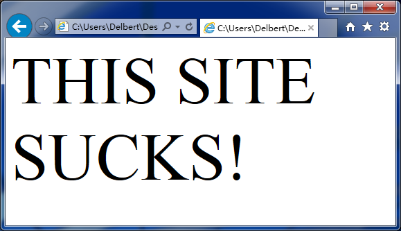

# 从字符串中移除HTML

```php
string strip_tags ( string source [, string allowable_tags])
```

使用`strip_tags()`可以从字符串中移除所有的HTML和PHP标记，当然，也可以使用第二个参数来指定想要的HTML标记。

这个函数在处理网站上用户的输入时非常有用。例如，可能有用户在你网站上的留言板里面留言`<h1>THIS SITE SUCKS!</h1>`，如果你每个板块都显示这个留言的话，很明显你不想让这么大的字母显示在访客的屏幕上。

下面是两个例子：

```php
<?php
    $input = "<blink><strong>Hello!</strong></blink>";
    $a = strip_tags($input);
    $b = strip_tags($input, "<strong><em>");
?>
```

运行上面的代码，`$a`成为“Hello!”而`$b`是“<strong>Hello!</strong>”，因为`<strong>`在允许标签的列表中。通过这种方式，你可以限制用户来改变你的页面。当然，如果你允许了一些HTML标签，还是可能出现一些状况的。例如我们可以使用CSS来改变`<strong>`tag：`<strong style="font: 72pt Times New Roman">THIS SITE SUCKS!</strong>`。



如果你允许`<strong>`标签，你就允许了**所有的**`<strong>`标签，不管里面是不是有你不想要的东西。所以，最好不要允许任何标签。
